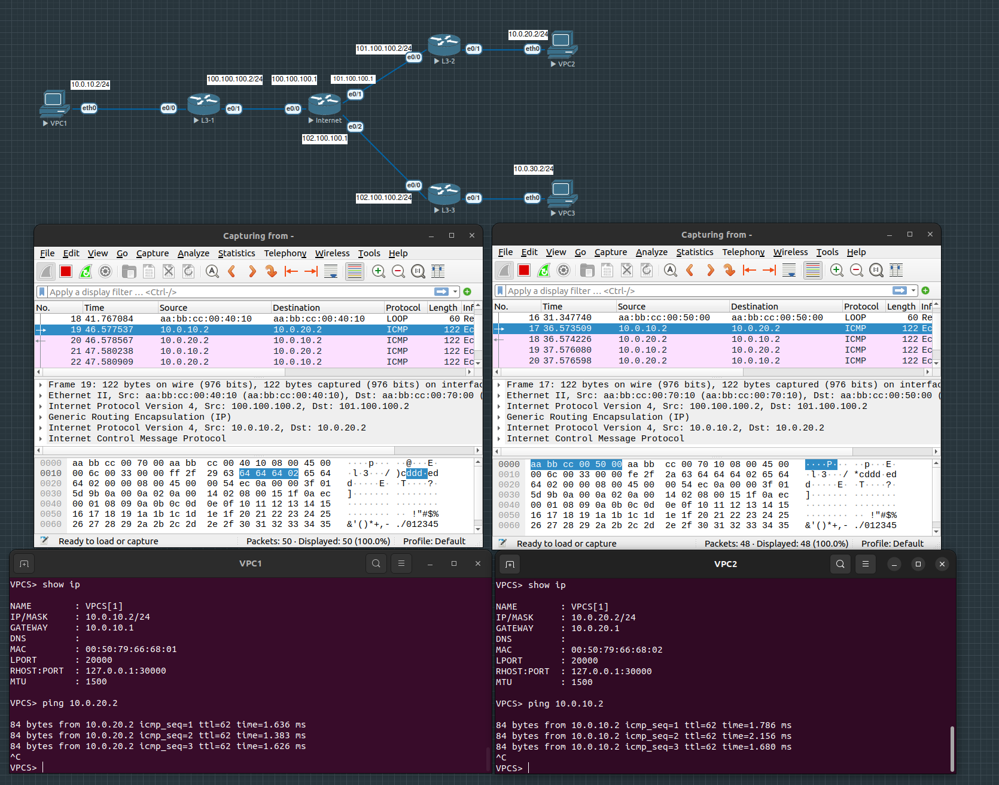
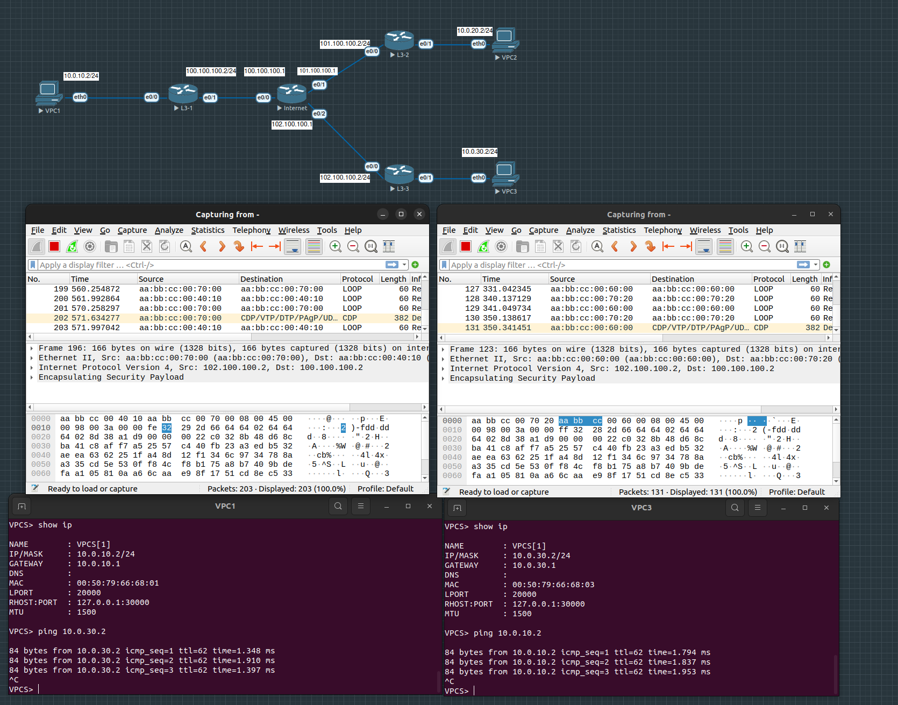
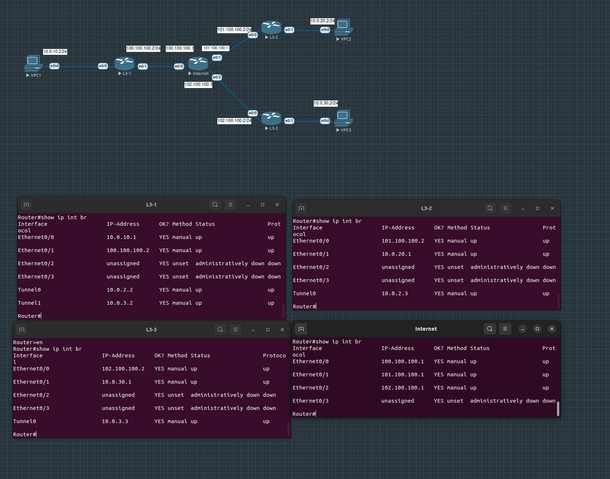
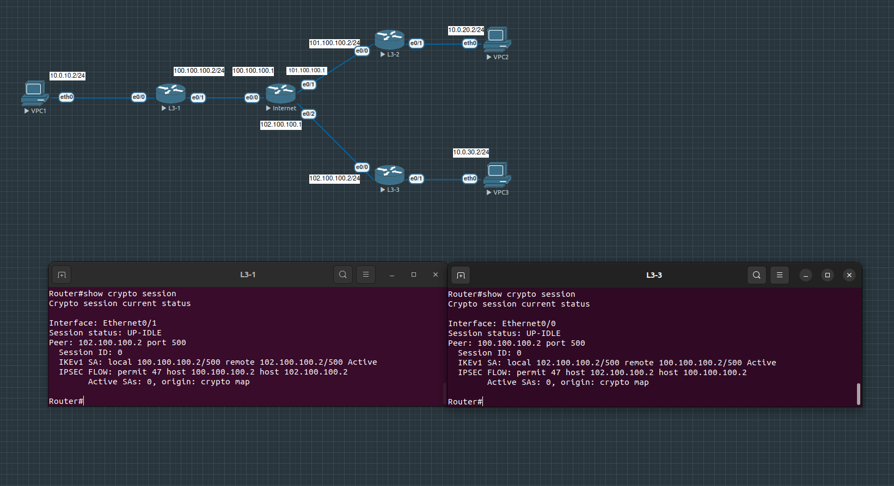

# ДЗ 4

- На L3-1, L3-2, L3-3 настроен Default маршрут в сторону интернет, также добавлены маршруты в рамках VPN
- Маршрутизатор, эмулируюрущий интернет, не знает ни о каких сетях, кроме directly connect
- Трафик между VPC1 и VPC2 проходит через GRE тоннель без шифрования
- Трафик между VPC1 и VPC3 проходит через GRE тоннель поверх IPSEC с шифрование. Алгоритм шифрования AES с использованием ESP-заголовка

## Пинг между VPC1 и VPC2

## Пинг между VPC1 и VPC2

## Настроки роутеров L3-1, L3-2, L3-3, Internet

## Crypto session

